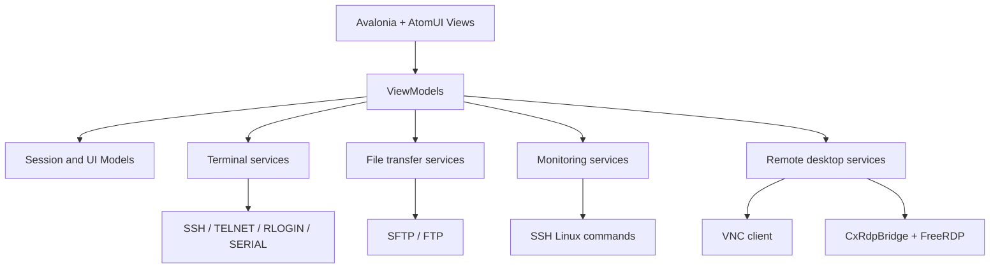

# CxShell

[English](README.md) | [简体中文](README.zh-CN.md)

CxShell is a cross-platform desktop remote session client built with .NET, Avalonia, and AtomUI. It is designed as a lightweight, extensible tool for daily operations and development work, bringing terminal sessions, file transfer, server monitoring, remote desktop, and classic network or serial protocols into one desktop application.

The project is still moving quickly. Windows is currently the primary development target, macOS packaging is available through local scripts and GitHub Actions, and Linux can be built as a standard Avalonia desktop application. RDP support depends on the platform-specific native `CxRdpBridge` library.

## Features

- Session management: create, duplicate, edit, delete, search, and save frequently used sessions.
- Multi-tab terminal workspace: multiple terminal tabs, tab grouping, vertical layout, horizontal layout, and tiled arrangement.
- Terminal rendering: built-in ANSI parsing, scrollback buffer, mouse selection, copy and paste, cursor rendering, and basic VT behavior.
- SSH connections: password authentication, private keys, SSH agent or Xagent, automatic reconnect, keep alive, compression, algorithm preferences, remote commands, and login scripts.
- SFTP panel: browse directories, upload, download, rename, delete, create folders, edit remote text files online, and follow the current terminal directory.
- FTP panel: shared file browser interaction through `IFileTransferService`, implemented with FluentFTP.
- Server monitoring: collect Linux CPU, memory, disk, and network information after an SSH session is connected.
- Terminal file transfer: built-in pure C# ZMODEM, XMODEM, and YMODEM upload and download support.
- TELNET, RLOGIN, and SERIAL: terminal protocols for network devices, legacy hosts, and serial devices.
- RDP: native `CxRdpBridge` wrapper around FreeRDP, bridged into Avalonia for framebuffer, mouse, and keyboard events.
- VNC: built-in RFB/VNC client with password authentication, VeNCrypt/TLS paths, and optional SSH tunneling.
- Proxy and tunneling: HTTP, SOCKS4, SOCKS4A, SOCKS5, SSH passthrough, jump host, and SSH local, remote, and dynamic forwarding.
- Remote file editor: open remote text files with AvaloniaEdit and syntax highlighting from TextMate grammars.
- Appearance settings: theme, font, color scheme, ANSI colors, cursor style, background image, window spacing, and highlight rules.
- Localization: Chinese and English UI text is included.

## Supported Protocols

| Protocol | Scope |
| --- | --- |
| SSH | Terminal sessions, SFTP, server monitoring, port forwarding, X11 forwarding, agent authentication, and agent forwarding |
| SFTP | Standard SSH.NET SFTP subsystem for file browsing and transfer |
| FTP | File transfer browser powered by FluentFTP |
| TELNET | TCP plus TELNET IAC negotiation filtering, with optional login prompt automation |
| RLOGIN | Standard null-delimited startup handshake and terminal window-size message |
| SERIAL | Serial terminal support through `System.IO.Ports` |
| RDP | Native FreeRDP bridge rendered in Avalonia, not treated as a terminal protocol |
| VNC | Built-in RFB client, optionally reachable through an SSH tunnel |
| ZMODEM/XMODEM/YMODEM | Terminal-based file upload and download |

## Tech Stack

| Area | Technology |
| --- | --- |
| Runtime | .NET 10 |
| UI framework | Avalonia 12 |
| UI components | AtomUI Desktop Controls 6 |
| MVVM | CommunityToolkit.Mvvm |
| SSH/SFTP | SSH.NET, SshNet.Agent |
| FTP | FluentFTP |
| Editor | AvaloniaEdit, AvaloniaEdit.TextMate, TextMateSharp.Grammars |
| Serial | System.IO.Ports |
| RDP bridge | C++ C ABI wrapper over FreeRDP 3.x |
| Packaging | `dotnet publish`, PowerShell or shell scripts, GitHub Actions for macOS |

## Architecture

CxShell is a single-project Avalonia desktop application. The application entry points are `Program.cs`, `App.axaml`, and `App.axaml.cs`. The codebase follows MVVM and keeps protocol, file transfer, monitoring, and native bridge responsibilities behind service boundaries.

```text
CxShell
|-- Views/          Avalonia windows, pages, dialogs, and composed views
|-- ViewModels/     MVVM state, commands, tab state, and interaction logic
|-- Models/         Session, proxy, tunnel, monitoring, and file item models
|-- Services/       SSH, SFTP, FTP, RDP, VNC, monitoring, and persistence services
|-- Terminal/       Terminal buffer, cells, ANSI parser, and color handling
|-- Controls/       Custom terminal control, charts, and reusable UI controls
|-- Converters/     Avalonia binding converters
|-- native/         CxRdpBridge native FreeRDP bridge
|-- tools/          RDP bridge build scripts and macOS app bundle scripts
`-- Assets/         Icons and Avalonia resources
```



### Design Notes

- `ITerminalConnectionService` abstracts terminal protocols. SSH, TELNET, RLOGIN, and SERIAL each provide their own connection and data transport implementation.
- `IFileTransferService` abstracts file browser backends. SFTP and FTP share upload, download, rename, delete, and directory creation behavior at the ViewModel layer.
- `TerminalBuffer` and `TerminalControl` own scrollback, visible viewport rendering, mouse selection, copy, paste, and terminal scrolling behavior.
- `SshConnectionService` owns SSH shell data, raw binary transfer events, automatic reconnect, X11 forwarding, and agent forwarding.
- `SftpViewModel` selects the file transfer backend from the session protocol and handles remote editing, drag and drop, and directory refresh.
- `RdpViewModel` talks to `CxRdpBridge` through `RdpBridgeClient`, keeping the FreeRDP native API behind a small C ABI boundary.
- `SessionStorageService` stores session data as JSON in the user configuration directory. Password fields are encrypted through `PasswordEncryptionService` before persistence.

## Requirements

### Basic Application

- .NET 10 SDK
- Git
- Windows 10/11, macOS 11+, or a mainstream Linux desktop environment

### RDP Bridge

RDP support depends on the native FreeRDP bridge. If you only need terminal, SFTP, FTP, VNC, and serial features, you can build the application without preparing the RDP bridge first.

Windows RDP bridge requirements:

- Visual Studio 2022 Build Tools or Visual Studio C++ toolchain
- CMake
- Ninja
- vcpkg
- FreeRDP 3.x installed through vcpkg

macOS/Linux RDP bridge requirements:

- CMake
- Ninja
- pkg-config
- vcpkg or system-provided FreeRDP 3.x

## Build From Source

Run commands from the repository root.

### Restore

```powershell
dotnet restore
```

### Build

```powershell
dotnet build CxShell.csproj
```

### Run

```powershell
dotnet run --project CxShell.csproj
```

### Format

```powershell
dotnet format CxShell.csproj
```

There is no dedicated automated test project yet. Before submitting changes, run at least:

```powershell
dotnet build CxShell.csproj
```

For changes touching SSH, SFTP, terminal behavior, RDP, VNC, or monitoring, manually connect to the affected protocol once and verify the workflow.

## Publish

### Windows x64

Standard publish directory:

```powershell
dotnet publish CxShell.csproj `
  -c Release `
  -r win-x64 `
  --self-contained true `
  -o artifacts\publish\win-x64 `
  /p:DebugType=none `
  /p:DebugSymbols=false
```

Single-file publish:

```powershell
dotnet publish CxShell.csproj `
  -c Release `
  -r win-x64 `
  --self-contained true `
  -o artifacts\publish\win-x64-single `
  /p:PublishSingleFile=true `
  /p:IncludeNativeLibrariesForSelfExtract=true `
  /p:DebugType=none `
  /p:DebugSymbols=false
```

If RDP support is required, build and copy the native bridge plus FreeRDP runtime libraries first:

```powershell
$env:VCPKG_ROOT = "D:\develop\vcpkg"

tools\build-rdp-bridge.ps1 `
  -VcpkgRoot $env:VCPKG_ROOT `
  -Triplet x64-windows `
  -OutputDir runtimes\win-x64\native

dotnet publish CxShell.csproj `
  -c Release `
  -r win-x64 `
  --self-contained true `
  -o artifacts\publish\win-x64 `
  /p:DebugType=none `
  /p:DebugSymbols=false
```

After publishing, start `CxShell.exe` from `artifacts\publish\win-x64`.

### macOS

macOS supports `osx-arm64` and `osx-x64`. The following example targets Apple Silicon:

```bash
dotnet publish CxShell.csproj \
  -c Release \
  -r osx-arm64 \
  --self-contained true \
  -o artifacts/publish/osx-arm64 \
  /p:PublishSingleFile=false \
  /p:DebugType=none \
  /p:DebugSymbols=false
```

Create the `.app` bundle:

```bash
export PUBLISH_DIR="$PWD/artifacts/publish/osx-arm64"
export ARTIFACT_DIR="$PWD/artifacts/CxShell-macos-arm64"
export ARCH="arm64"
export BUNDLE_VERSION="1.0.0"
export BUNDLE_SHORT_VERSION="1.0.0"

bash tools/package-macos-app.sh
```

If RDP support is required, build the bridge into the app `Contents/MacOS` directory:

```bash
export VCPKG_ROOT="$HOME/vcpkg"
export OUTPUT_DIR="$PWD/artifacts/CxShell-macos-arm64/CxShell.app/Contents/MacOS"
export TRIPLET="arm64-osx"

bash tools/build-rdp-bridge.sh
```

Local ad-hoc signing:

```bash
codesign --force --deep --sign - artifacts/CxShell-macos-arm64/CxShell.app
```

After downloading or copying an unsigned build to another Mac, Gatekeeper may block it. If you trust the source, remove the quarantine flag:

```bash
chmod +x CxShell.app/Contents/MacOS/CxShell
xattr -dr com.apple.quarantine CxShell.app
```

### Linux x64

Linux can be published like a regular Avalonia desktop application:

```bash
dotnet publish CxShell.csproj \
  -c Release \
  -r linux-x64 \
  --self-contained true \
  -o artifacts/publish/linux-x64 \
  /p:PublishSingleFile=false \
  /p:DebugType=none \
  /p:DebugSymbols=false
```

If RDP support is required:

```bash
export VCPKG_ROOT="$HOME/vcpkg"
export OUTPUT_DIR="$PWD/artifacts/publish/linux-x64"
export TRIPLET="x64-linux"

bash tools/build-rdp-bridge.sh
```

## GitHub Actions

The repository includes a release packaging workflow:

```text
.github/workflows/release.yml
```

It can be triggered in two ways:

- Push a `v*` tag, for example `v0.1.0`.
- Run the `Release Packages` workflow manually and provide a release tag.

The workflow builds and uploads these GitHub Release assets:

- `CxShell-<tag>-win-x64.zip`
- `CxShell-<tag>-win-arm64.zip`
- `CxShell-<tag>-win-x86.zip`
- `CxShell-<tag>-linux-x64.tar.gz`
- `CxShell-<tag>-linux-arm64.tar.gz`
- `CxShell-<tag>-macos-arm64.tar.gz`
- `CxShell-<tag>-macos-x64.tar.gz`

The packages are self-contained application builds. Windows, macOS, and Linux packages include the native RDP bridge and adjacent FreeRDP/WinPR runtime libraries for the matching CPU architecture.

To publish a release from the command line:

```bash
git tag v0.1.0
git push github v0.1.0
```

After the workflow completes, open the repository on GitHub, go to `Releases`, and download the package that matches your operating system and CPU architecture.

The repository also keeps a macOS-only packaging workflow for manual verification:

```text
.github/workflows/macos-package.yml
```

Run `macOS Package` manually from the GitHub Actions page when you only need macOS artifacts without creating a GitHub Release.

## Runtime Files And Git

These directories are generally not committed:

- `bin/`
- `obj/`
- `artifacts/`
- `publish/`
- `runtimes/`
- `.vcpkg/`
- `native/**/build/`
- `.buildcheck*/`
- `.tmp/`

`runtimes/` is mainly used for local native runtime files, such as `CxRdpBridge.dll`, `libCxRdpBridge.dylib`, and FreeRDP/WinPR dynamic libraries. For an open-source repository, these files should normally be produced by scripts or CI instead of committed from a local build machine.

## Project Status

CxShell is currently closer to a fast-moving usable preview than a long-term stable release. Protocol support and UI experience are still evolving, especially around the RDP bridge, VNC compatibility, the remote file editor, and cross-platform packaging.

Issues, feature requests, and pull requests are welcome. For changes related to protocols, terminal rendering, or file transfer, please include reproduction steps, target server or system information when possible, and manual verification results.

## License

CxShell is licensed under the [Apache License 2.0](LICENSE). You may use it for free, including for commercial purposes.

If you redistribute modified source code or binaries, keep the copyright, license, and NOTICE information, and make clear which files or parts were changed.

## Thanks

CxShell uses AtomUI's Avalonia controls and theme capabilities for much of its interface. Thanks to the AtomUI open-source project for providing the desktop control ecosystem and design foundation.

- AtomUI GitHub: https://github.com/AtomUI/AtomUI
- Avalonia: https://github.com/AvaloniaUI/Avalonia
- FreeRDP: https://github.com/FreeRDP/FreeRDP
