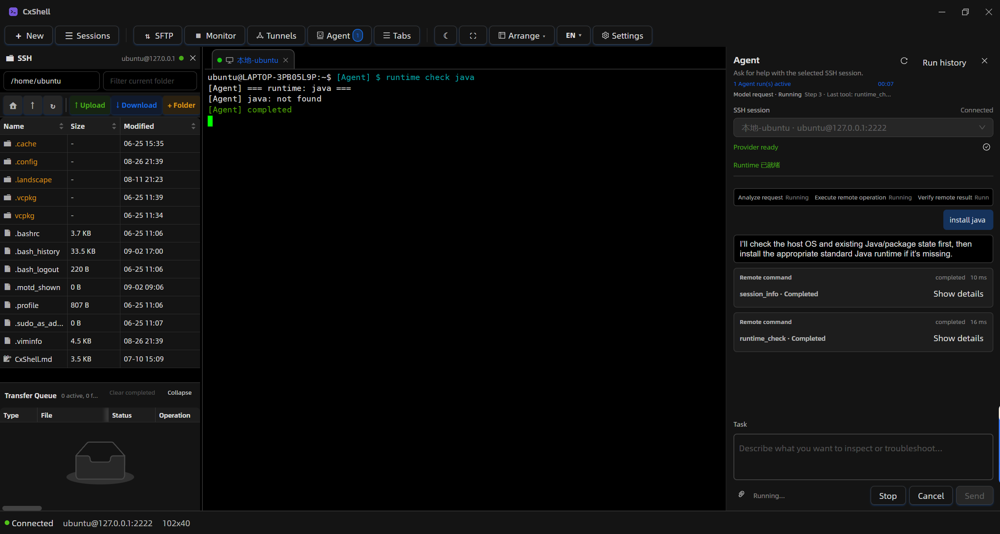
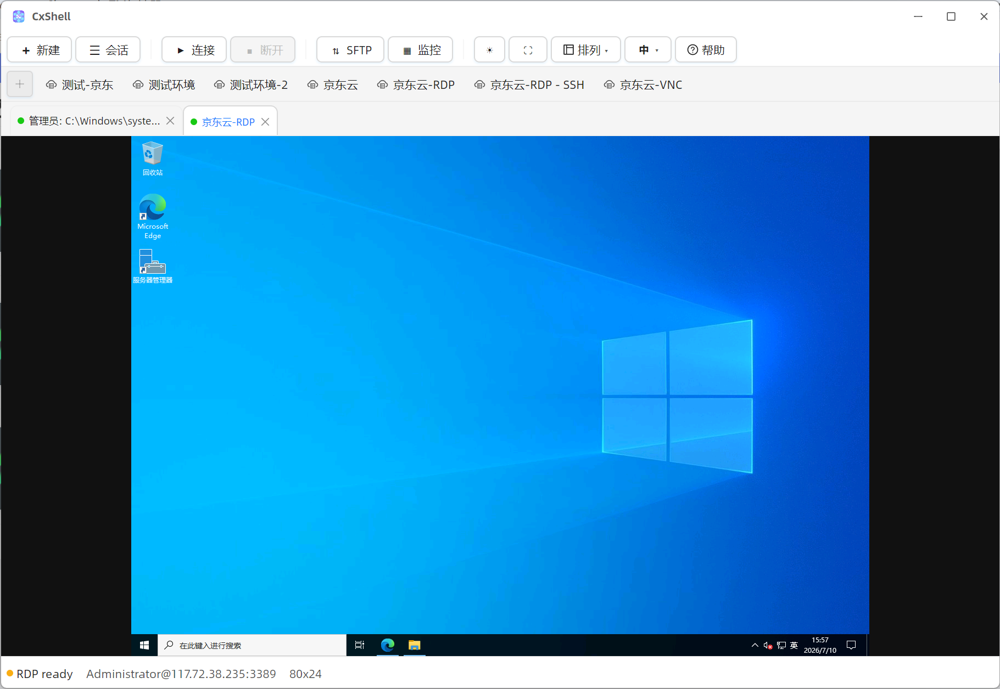
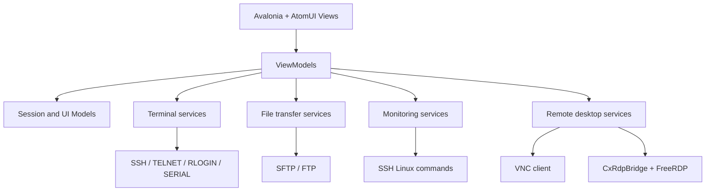

# CxShell

[English](README.md) | [简体中文](README.zh-CN.md)

CxShell is a cross-platform desktop remote session client built with .NET, Avalonia, and AtomUI. It is designed as a lightweight, extensible tool for daily operations and development work, bringing terminal sessions, file transfer, server monitoring, remote desktop, and classic network or serial protocols into one desktop application.

The project is still moving quickly. Windows is currently the primary development target, macOS packaging is available through local scripts and GitHub Actions, and Linux can be built as a standard Avalonia desktop application. RDP support depends on the platform-specific native `CxRdpBridge` library.

## Latest Release

The latest release is [CxShell v0.1.43](https://github.com/xiaochengzjc/CxShell/releases/tag/v0.1.43). It includes the Agent Runtime and SSH session gateway, permission and approval controls, run history and cancellation, OpenAI-compatible streaming providers, image and document attachments, Markdown rendering, and the latest terminal and remote-session improvements.

Packages are available for Windows x64, macOS x64/arm64, and Linux x64/arm64. The release page provides Windows and macOS installers or portable archives, plus Linux AppImage and tar.gz packages.

## Screenshots

### SSH Workspace, SFTP, and Server Monitoring



CxShell keeps the terminal, remote file browser, transfer queue, and server metrics together in one workspace.

### Integrated RDP Session



RDP sessions run inside the same tabbed workspace and share CxShell's session management experience.

## Features

- Session management: create, duplicate, edit, delete, search, and save frequently used sessions.
- Multi-tab terminal workspace: multiple terminal tabs, tab grouping, vertical layout, horizontal layout, and tiled arrangement.
- Terminal rendering: built-in ANSI parsing, scrollback buffer, mouse selection, copy and paste, cursor rendering, and basic VT behavior.
- SSH connections: password authentication, private keys, SSH agent or Xagent, automatic reconnect, keep alive, compression, algorithm preferences, remote commands, and login scripts.
- SFTP panel: browse directories, upload, download, rename, delete, create folders, edit remote text files online, and follow the current terminal directory.
- FTP panel: shared file browser interaction through `IFileTransferService`, implemented with FluentFTP.
- Server monitoring: collect Linux CPU, memory, disk, and network information after an SSH session is connected.
- Terminal file transfer: built-in pure C# ZMODEM, XMODEM, and YMODEM upload and download support.
- TELNET, RLOGIN, and SERIAL: terminal protocols for network devices, legacy hosts, and serial devices.
- RDP: native `CxRdpBridge` wrapper around FreeRDP, bridged into Avalonia for framebuffer, mouse, and keyboard events.
- VNC: built-in RFB/VNC client with password authentication, VeNCrypt/TLS paths, and optional SSH tunneling.
- Proxy and tunneling: HTTP, SOCKS4, SOCKS4A, SOCKS5, SSH passthrough, jump host, and SSH local, remote, and dynamic forwarding.
- Remote file editor: open remote text files with AvaloniaEdit and syntax highlighting from TextMate grammars.
- Appearance settings: theme, font, color scheme, ANSI colors, cursor style, background image, window spacing, and highlight rules.
- Localization: Chinese and English UI text is included.

## Supported Protocols

| Protocol | Scope |
| --- | --- |
| SSH | Terminal sessions, SFTP, server monitoring, port forwarding, X11 forwarding, agent authentication, and agent forwarding |
| SFTP | Standard SSH.NET SFTP subsystem for file browsing and transfer |
| FTP | File transfer browser powered by FluentFTP |
| TELNET | TCP plus TELNET IAC negotiation filtering, with optional login prompt automation |
| RLOGIN | Standard null-delimited startup handshake and terminal window-size message |
| SERIAL | Serial terminal support through `System.IO.Ports` |
| RDP | Native FreeRDP bridge rendered in Avalonia, not treated as a terminal protocol |
| VNC | Built-in RFB client, optionally reachable through an SSH tunnel |
| ZMODEM/XMODEM/YMODEM | Terminal-based file upload and download |

## Tech Stack

| Area | Technology |
| --- | --- |
| Runtime | .NET 10 |
| UI framework | Avalonia 12 |
| UI components | AtomUI Desktop Controls 6 |
| MVVM | CommunityToolkit.Mvvm |
| SSH/SFTP | SSH.NET, SshNet.Agent |
| FTP | FluentFTP |
| Editor | AvaloniaEdit, AvaloniaEdit.TextMate, TextMateSharp.Grammars |
| Serial | System.IO.Ports |
| RDP bridge | C++ C ABI wrapper over FreeRDP 3.x |
| Packaging | `dotnet publish`, PowerShell or shell scripts, GitHub Actions for macOS |

## Architecture

CxShell is a single-project Avalonia desktop application. The application entry points are `Program.cs`, `App.axaml`, and `App.axaml.cs`. The codebase follows MVVM and keeps protocol, file transfer, monitoring, and native bridge responsibilities behind service boundaries.

```text
CxShell
|-- Views/          Avalonia windows, pages, dialogs, and composed views
|-- ViewModels/     MVVM state, commands, tab state, and interaction logic
|-- Models/         Session, proxy, tunnel, monitoring, and file item models
|-- Services/       SSH, SFTP, FTP, RDP, VNC, monitoring, and persistence services
|-- Terminal/       Terminal buffer, cells, ANSI parser, and color handling
|-- Controls/       Custom terminal control, charts, and reusable UI controls
|-- Converters/     Avalonia binding converters
|-- native/         CxRdpBridge native FreeRDP bridge
|-- tools/          RDP bridge build scripts and macOS app bundle scripts
`-- Assets/         Icons and Avalonia resources
```


```mermaid
flowchart TD
    A["Avalonia + AtomUI Views"] --> B["ViewModels"]
    B --> C["Session and UI Models"]
    B --> D["Terminal services"]
    B --> E["File transfer services"]
    B --> F["Monitoring services"]
    B --> G["Remote desktop services"]
    D --> H["SSH / TELNET / RLOGIN / SERIAL"]
    E --> I["SFTP / FTP"]
    F --> J["SSH Linux commands"]
    G --> K["VNC client"]
    G --> L["CxRdpBridge + FreeRDP"]
```

### Design Notes

- `ITerminalConnectionService` abstracts terminal protocols. SSH, TELNET, RLOGIN, and SERIAL each provide their own connection and data transport implementation.
- `IFileTransferService` abstracts file browser backends. SFTP and FTP share upload, download, rename, delete, and directory creation behavior at the ViewModel layer.
- `TerminalBuffer` and `TerminalControl` own scrollback, visible viewport rendering, mouse selection, copy, paste, and terminal scrolling behavior.
- `SshConnectionService` owns SSH shell data, raw binary transfer events, automatic reconnect, X11 forwarding, and agent forwarding.
- `SftpViewModel` selects the file transfer backend from the session protocol and handles remote editing, drag and drop, and directory refresh.
- `RdpViewModel` talks to `CxRdpBridge` through `RdpBridgeClient`, keeping the FreeRDP native API behind a small C ABI boundary.
- `SessionStorageService` stores session data as JSON in the user configuration directory. Password fields are encrypted through `PasswordEncryptionService` before persistence.

### Agent Base Interface

The Agent panel exposes Runtime initialization state and failure details. Runtime initialization can be retried, retaining the attempt number, request ID, error code, and error text for diagnosis; a session-list refresh failure is reported separately instead of being mistaken for a failed Runtime handshake.

CxShell includes a permission-protected Agent Runtime session boundary. The Agent can currently access only opened SSH Terminal sessions through this boundary; it cannot operate Avalonia controls or raw SSH connections. Callers can use `initialize`, optionally passing `protocol` and `protocolVersion` in `params` for handshake validation; omitting them remains compatible. A successful response reports the runtime version, protocol version, methods, and currently available capabilities, while a mismatch returns the stable `protocol_mismatch` error. Callers can then use `agent/runtime-info` for the complete runtime description. Session discovery, command dispatch, fixed read-only diagnostics, fleet inspection, package/runtime checks, disk cleanup advice, run status, incremental run-event retrieval, redacted audit records, cancellation, and approval all use JSON requests and responses. The read-only operations never delete files or accept arbitrary paths and commands; they select bounded platform-specific plans supplied by CxShell. Failed Runtime requests include a stable `errorCode` alongside the display-oriented `error` text. `agent/run-list` returns active and recently completed runs, while `agent/run-status` reads one run's status and end reason. `agent/run-events` accepts a `runId`, an `afterSequence` cursor, and a bounded `limit`; its `hasGap` field reports when older events have already been evicted, and recent completed runs remain readable for a bounded in-memory retention window. Accepted background runs also publish their lifecycle events to a Runtime stream as `type: "event"` frames, correlated by the run ID.

Run summaries include the provider/model, a short task preview, model/tool call counts, duration, and a safe error classification. Completed summaries are persisted locally in `%LOCALAPPDATA%\CxShell\agent-runs.json`; command text, command output, credentials, and event payloads are not persisted. `agent/run-clear` removes completed summaries. Provider failures distinguish network, timeout, authentication, rate-limit, server, request, and protocol errors; retryable failures use a bounded exponential backoff, while user cancellation is kept separate. The Agent panel exposes the same history with event details, clear, and current-process-only retry actions. Gateway audit entries additionally record command risk, permission decision, and approval outcome without storing the raw command.

Agent command timeouts are normalized at the Session Gateway boundary. The Agent run defaults to 30 minutes, normal remote commands default to 10 minutes, and package-manager, installer, and runtime install/upgrade commands default to 20 minutes with a 10-minute minimum even when a model suggests a shorter value. The global Agent policy can optionally require approval for every modifying command; dangerous commands retain their separate approval rule, and read-only mode still blocks all changes.

Active runs accept queued follow-up user messages through `agent/run-append`; they are added to the next conversation turn after the current model or tool operation finishes, with a maximum of 32 queued messages per run. `agent/run-stop` requests a graceful stop and waits for the current model or SSH tool operation to finish, while the existing `agent/cancel` remains the immediate cancellation method.

OpenAI-compatible providers support SSE streaming. Model text reaches the Agent panel as incremental events, while tool-call arguments from both Chat Completions and the Responses API are buffered and validated locally before they reach the Session Gateway. Once a streaming response has emitted content, a later network failure is not silently retried, preventing duplicated output or execution.

The current interface is in-process. `AgentRuntimeHost` owns method routing, module registration, request lifecycle tracking, and cancellation by `requestId`, while `IAgentRuntimeModule` receives a request-scoped cancellation/event context. Long-lived modules can additionally implement `IAgentRuntimeEventSource`; the Host owns that subscription and forwards events after the original request has returned. Duplicate active request IDs are rejected. `AgentRuntimeJsonEndpoint` converts one JSON request into a Host call and returns one JSON response; it accepts the standard `params` field and the existing `parameters` alias. `AgentRuntimeClient` adds request ID generation, response correlation, typed result deserialization, stable protocol exceptions, and optional event subscriptions over `IAgentRuntimeTransport`; its `InitializeAsync`, `GetRuntimeInfoAsync`, and `CheckCapabilityAsync` helpers provide typed protocol discovery and capability checks. `AgentRuntimeSession` adds one negotiated client lifecycle: the first call performs `initialize`, concurrent first calls share that handshake, advertised methods are checked before dispatch, and a failed handshake can be retried. Event payloads are exposed as JSON values consistently across the internal transports. `InProcessAgentRuntimeTransport` is the transport used by the CxShell Agent panel, while `AgentRuntimeStreamTransport`, `AgentRuntimeFrameCodec`, `AgentRuntimeFrameEndpoint`, and `AgentRuntimeStreamSession` provide testable internal framing and stream abstractions. Event frames use `type: "event"` and carry the module, request ID, method, event name, and payload; they share the same stream as responses. The Agent panel keeps a background active-run count, exposes all/current-session/running history filters, and keeps retry/continue/details actions tied to the same retained run records. The Session Gateway adapter remains the only route to sessions, so the Agent cannot bypass CxShell's permission policy or access Avalonia controls and raw SSH connections.

The `runtime/cancel` method lets a Runtime caller cancel an active request by its `requestId` and reports whether the target was still active. The typed `AgentRuntimeClient.CancelRequestAsync` helper uses this method. When a caller cancels a request through `AgentRuntimeStreamTransport`, the transport sends this protocol cancellation on a best-effort basis so the remote Host can stop the work too.

OpenCowork is an architectural reference only. CxShell does not start, embed, or communicate with the OpenCowork application; its Agent Runtime, tool registration, permission policy, run coordination, and Session Gateway are implemented and owned by CxShell. The read-only `agent/tool-catalog` method exposes the tools, descriptions, JSON Schemas, and current gateway availability used by CxShell's own Agent panel.

## Requirements

### Basic Application

- .NET 10 SDK
- Git
- Windows 10/11, macOS 11+, or a mainstream Linux desktop environment

### RDP Bridge

RDP support depends on the native FreeRDP bridge. If you only need terminal, SFTP, FTP, VNC, and serial features, you can build the application without preparing the RDP bridge first.

Windows RDP bridge requirements:

- Visual Studio 2022 Build Tools or Visual Studio C++ toolchain
- CMake
- vcpkg
- FreeRDP 3.x installed through vcpkg

Windows RDP bridge builds are expected to be pure MSVC. The Windows script uses the Visual Studio CMake generator, rejects MinGW runtime dependencies, and copies the required Visual C++ runtime DLLs into the output package.

macOS/Linux RDP bridge requirements:

- CMake
- Ninja
- pkg-config
- vcpkg or system-provided FreeRDP 3.x

## Build From Source

Run commands from the repository root.

### Restore

```powershell
dotnet restore
```

### Build

```powershell
dotnet build CxShell.csproj
```

### Run

```powershell
dotnet run --project CxShell.csproj
```

### Format

```powershell
dotnet format CxShell.csproj
```

The repository includes the `CxShell.Tests` automated test project. Before submitting changes, run:

```powershell
dotnet build CxShell.csproj
dotnet test CxShell.Tests/CxShell.Tests.csproj
```

For changes touching SSH, SFTP, terminal behavior, RDP, VNC, or monitoring, manually connect to the affected protocol once and verify the workflow.

## Publish

### Windows x64

Standard publish directory:

```powershell
dotnet publish CxShell.csproj `
  -c Release `
  -r win-x64 `
  --self-contained true `
  -o artifacts\publish\win-x64 `
  /p:DebugType=none `
  /p:DebugSymbols=false
```

Single-file publish:

```powershell
dotnet publish CxShell.csproj `
  -c Release `
  -r win-x64 `
  --self-contained true `
  -o artifacts\publish\win-x64-single `
  /p:PublishSingleFile=true `
  /p:IncludeNativeLibrariesForSelfExtract=true `
  /p:DebugType=none `
  /p:DebugSymbols=false
```

If RDP support is required, build and copy the native bridge plus FreeRDP runtime libraries first:

```powershell
$env:VCPKG_ROOT = "D:\develop\vcpkg"

tools\build-rdp-bridge.ps1 `
  -VcpkgRoot $env:VCPKG_ROOT `
  -Triplet x64-windows `
  -OutputDir runtimes\win-x64\native

dotnet publish CxShell.csproj `
  -c Release `
  -r win-x64 `
  --self-contained true `
  -o artifacts\publish\win-x64 `
  /p:DebugType=none `
  /p:DebugSymbols=false
```

After publishing, start `CxShell.exe` from `artifacts\publish\win-x64`.

### macOS

macOS supports `osx-arm64` and `osx-x64`. The following example targets Apple Silicon:

```bash
dotnet publish CxShell.csproj \
  -c Release \
  -r osx-arm64 \
  --self-contained true \
  -o artifacts/publish/osx-arm64 \
  /p:PublishSingleFile=false \
  /p:DebugType=none \
  /p:DebugSymbols=false
```

Create the `.app` bundle:

```bash
export PUBLISH_DIR="$PWD/artifacts/publish/osx-arm64"
export ARTIFACT_DIR="$PWD/artifacts/CxShell-macos-arm64"
export ARCH="arm64"
export BUNDLE_VERSION="1.0.0"
export BUNDLE_SHORT_VERSION="1.0.0"

bash tools/package-macos-app.sh
```

If RDP support is required, build the bridge into the app `Contents/MacOS` directory:

```bash
export VCPKG_ROOT="$HOME/vcpkg"
export OUTPUT_DIR="$PWD/artifacts/CxShell-macos-arm64/CxShell.app/Contents/MacOS"
export TRIPLET="arm64-osx"

bash tools/build-rdp-bridge.sh
```

Local ad-hoc signing:

```bash
codesign --force --deep --sign - artifacts/CxShell-macos-arm64/CxShell.app
```

After downloading or copying an unsigned build to another Mac, Gatekeeper may block it. If you trust the source, remove the quarantine flag:

```bash
chmod +x CxShell.app/Contents/MacOS/CxShell
xattr -dr com.apple.quarantine CxShell.app
```

### Linux x64

Linux can be published like a regular Avalonia desktop application:

```bash
dotnet publish CxShell.csproj \
  -c Release \
  -r linux-x64 \
  --self-contained true \
  -o artifacts/publish/linux-x64 \
  /p:PublishSingleFile=false \
  /p:DebugType=none \
  /p:DebugSymbols=false
```

If RDP support is required:

```bash
export VCPKG_ROOT="$HOME/vcpkg"
export OUTPUT_DIR="$PWD/artifacts/publish/linux-x64"
export TRIPLET="x64-linux"

bash tools/build-rdp-bridge.sh
```

## GitHub Actions

The repository includes a release packaging workflow:

```text
.github/workflows/release.yml
```

It can be triggered in two ways:

- Push a `v*` tag, for example `v0.1.0`.
- Run the `Release Packages` workflow manually and provide a release tag.

The workflow builds and uploads these GitHub Release assets:

- `CxShell-<tag>-win-x64.zip`
- `CxShell-<tag>-linux-x64.tar.gz`
- `CxShell-<tag>-linux-arm64.tar.gz`
- `CxShell-<tag>-macos-arm64.tar.gz`
- `CxShell-<tag>-macos-x64.tar.gz`

The packages are self-contained application builds. Automated Windows release packaging currently targets `win-x64`; macOS and Linux publish both x64 and arm64 packages. These packages include the native RDP bridge and adjacent FreeRDP/WinPR runtime libraries for the matching CPU architecture.

To publish a release from the command line:

```bash
git tag v0.1.0
git push github v0.1.0
```

After the workflow completes, open the repository on GitHub, go to `Releases`, and download the package that matches your operating system and CPU architecture.

The repository also keeps a macOS-only packaging workflow for manual verification:

```text
.github/workflows/macos-package.yml
```

Run `macOS Package` manually from the GitHub Actions page when you only need macOS artifacts without creating a GitHub Release.

## Runtime Files And Git

These directories are generally not committed:

- `bin/`
- `obj/`
- `artifacts/`
- `publish/`
- `runtimes/`
- `.vcpkg/`
- `native/**/build/`
- `.buildcheck*/`
- `.tmp/`

`runtimes/` is mainly used for local native runtime files, such as `CxRdpBridge.dll`, `libCxRdpBridge.dylib`, and FreeRDP/WinPR dynamic libraries. For an open-source repository, these files should normally be produced by scripts or CI instead of committed from a local build machine.

## Project Status

CxShell is currently closer to a fast-moving usable preview than a long-term stable release. Protocol support and UI experience are still evolving, especially around the RDP bridge, VNC compatibility, the remote file editor, and cross-platform packaging.

Issues, feature requests, and pull requests are welcome. For changes related to protocols, terminal rendering, or file transfer, please include reproduction steps, target server or system information when possible, and manual verification results.

## Support

CxShell is open source and free to use. If it helps your work, you can support ongoing development through Ko-fi, WeChat Pay, or Alipay.

For overseas users:

[](https://ko-fi.com/xiaochengzjc)

For users in China:

- WeChat ID: `ruochujiangzi`

<table>
  <tr>
    <td align="center">
      <strong>WeChat Pay</strong><br>
      
    </td>
    <td align="center">
      <strong>Alipay</strong><br>
      
    </td>
  </tr>
</table>

## Contact

For project feedback and technical discussion, you can add the author on WeChat.

- WeChat ID: `ruochujiangzi`


## License

CxShell is licensed under the [Apache License 2.0](LICENSE). You may use it for free, including for commercial purposes.

If you redistribute modified source code or binaries, keep the copyright, license, and NOTICE information, and make clear which files or parts were changed.

## Thanks

CxShell uses AtomUI's Avalonia controls and theme capabilities for much of its interface. Thanks to the AtomUI open-source project for providing the desktop control ecosystem and design foundation.

- AtomUI GitHub: https://github.com/AtomUI/AtomUI
- Avalonia: https://github.com/AvaloniaUI/Avalonia
- FreeRDP: https://github.com/FreeRDP/FreeRDP
