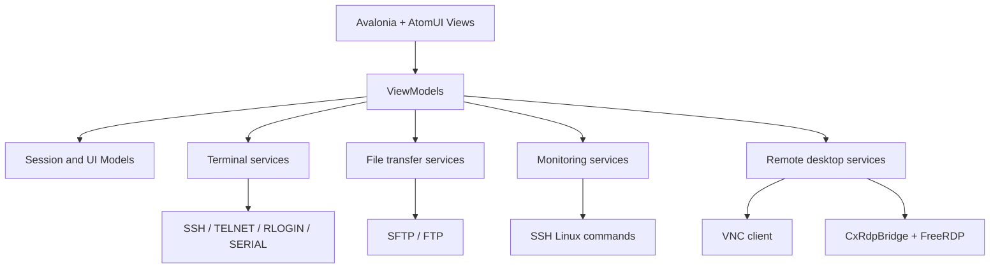

# CxShell

[English](README.md) | [简体中文](README.zh-CN.md)

CxShell 是一个使用 .NET、Avalonia 和 AtomUI 构建的跨平台远程会话桌面客户端。项目目标是提供一个轻量、可扩展、面向日常运维和开发工作的桌面工具，把终端、文件传输、服务器监控、远程桌面以及常见串口/网络协议放在同一个应用里管理。

当前项目仍在快速迭代中。Windows 是主要开发目标，macOS 已提供本地脚本和 GitHub Actions 打包流程，Linux 也可以按普通 Avalonia 桌面应用方式编译运行。RDP 功能依赖对应平台的原生 `CxRdpBridge` 桥接库。

## 功能特性

- 会话管理：支持创建、复制、编辑、删除、搜索会话，并保存常用快速会话。
- 多标签终端工作区：支持多个终端标签、标签分组、垂直布局、水平布局和平铺排列。
- 终端渲染：内置 ANSI 解析、终端缓冲区、滚动历史、鼠标选择、复制粘贴、光标显示和基础 VT 行为。
- SSH 连接：支持密码、私钥、SSH agent/Xagent、自动重连、Keep Alive、压缩、算法偏好、远程命令、登录脚本等配置。
- SFTP 面板：支持目录浏览、上传、下载、重命名、删除、新建目录、远程文件在线编辑，以及跟随终端当前目录。
- FTP 面板：通过统一文件传输接口接入 FluentFTP，和 SFTP 共享文件浏览器交互模型。
- 服务器监控：SSH 连接后可采集 Linux 服务器 CPU、内存、磁盘和网络信息。
- 终端文件传输：内置纯 C# 的 ZMODEM、XMODEM、YMODEM 上传/下载实现。
- TELNET、RLOGIN、SERIAL：提供非 SSH 终端协议支持，适合网络设备、传统主机和串口设备场景。
- RDP：通过原生 `CxRdpBridge` 封装 FreeRDP，并把帧缓冲、鼠标和键盘事件桥接到 Avalonia UI。
- VNC：内置 RFB/VNC 客户端，支持密码认证、VeNCrypt/TLS 路径和 SSH 隧道配置。
- 代理与隧道：支持 HTTP、SOCKS4、SOCKS4A、SOCKS5、SSH passthrough、JumpHost，以及 SSH local、remote、dynamic forwarding。
- 远程文件编辑：使用 AvaloniaEdit 打开远程文本文件，并通过 TextMate 语法定义提供高亮。
- 外观配置：支持主题、字体、配色方案、ANSI 颜色、光标、背景图、窗口间距和高亮规则。
- 本地化：目前包含中文和英文界面文本。

## 支持的协议

| 协议 | 范围 |
| --- | --- |
| SSH | 终端连接、SFTP、服务器监控、端口转发、X11 转发、agent 认证和 agent 转发 |
| SFTP | SSH.NET 标准 SFTP subsystem，支持文件浏览和传输 |
| FTP | 基于 FluentFTP 的文件传输浏览器 |
| TELNET | TCP 加 TELNET IAC 协商过滤，支持登录提示自动发送用户名和密码 |
| RLOGIN | 标准 null-delimited startup handshake 和窗口大小消息 |
| SERIAL | 基于 `System.IO.Ports` 的串口终端 |
| RDP | 原生 FreeRDP 桥接库渲染到 Avalonia，不作为终端协议处理 |
| VNC | 内置 RFB 客户端，可通过 SSH 隧道访问内网 VNC 服务 |
| ZMODEM/XMODEM/YMODEM | 终端内文件上传和下载 |

## 技术栈

| 领域 | 技术 |
| --- | --- |
| 运行时 | .NET 10 |
| UI 框架 | Avalonia 12 |
| UI 控件 | AtomUI Desktop Controls 6 |
| MVVM | CommunityToolkit.Mvvm |
| SSH/SFTP | SSH.NET, SshNet.Agent |
| FTP | FluentFTP |
| 编辑器 | AvaloniaEdit, AvaloniaEdit.TextMate, TextMateSharp.Grammars |
| 串口 | System.IO.Ports |
| RDP 原生桥接 | 基于 FreeRDP 3.x 的 C++ C ABI 封装 |
| 打包 | `dotnet publish`、PowerShell/shell 脚本、GitHub Actions macOS 打包 |

## 架构

CxShell 是单项目 Avalonia 桌面应用，入口文件为 `Program.cs`、`App.axaml` 和 `App.axaml.cs`。整体结构按 MVVM 和服务边界拆分，协议、文件传输、监控和原生桥接能力都放在相对独立的服务层后面。

```text
CxShell
|-- Views/          Avalonia 窗口、页面、对话框和视图组合
|-- ViewModels/     MVVM 状态、命令、标签页状态和交互逻辑
|-- Models/         会话、代理、隧道、监控和文件项等数据对象
|-- Services/       SSH、SFTP、FTP、RDP、VNC、监控和持久化等后端服务
|-- Terminal/       终端缓冲区、单元格、ANSI 解析和颜色处理
|-- Controls/       自定义终端控件、图表控件和复用控件
|-- Converters/     Avalonia 绑定转换器
|-- native/         CxRdpBridge 原生 FreeRDP 桥接库
|-- tools/          RDP bridge 构建脚本和 macOS app bundle 打包脚本
`-- Assets/         图标和 Avalonia 资源
```



### 设计要点

- `ITerminalConnectionService` 是终端协议抽象，SSH、TELNET、RLOGIN、SERIAL 各自实现连接和数据收发。
- `IFileTransferService` 是文件浏览器后端抽象，SFTP 和 FTP 共享上传、下载、重命名、删除、新建目录等上层行为。
- `TerminalBuffer` 和 `TerminalControl` 负责终端历史、可视区域、选择、复制、粘贴和滚动行为。
- `SshConnectionService` 负责 SSH shell、原始二进制数据事件、自动重连、X11 转发和 agent forwarding。
- `SftpViewModel` 根据会话协议选择 SFTP 或 FTP 后端，并负责远程文件编辑、拖拽和目录刷新。
- `RdpViewModel` 通过 `RdpBridgeClient` 调用 `CxRdpBridge`，避免 C# 直接绑定复杂 FreeRDP 结构。
- `SessionStorageService` 使用 JSON 保存会话数据到用户配置目录，密码字段会通过 `PasswordEncryptionService` 加密后保存。

## 环境要求

### 基础应用

- .NET 10 SDK
- Git
- Windows 10/11、macOS 11+ 或主流 Linux 桌面环境

### RDP Bridge

RDP 功能依赖原生 FreeRDP 桥接库。如果只构建终端、SFTP、FTP、VNC 和串口功能，可以先跳过这部分。

Windows 构建 RDP bridge 需要：

- Visual Studio 2022 Build Tools 或 Visual Studio C++ toolchain
- CMake
- vcpkg
- 通过 vcpkg 安装 FreeRDP 3.x

Windows RDP bridge 预期使用纯 MSVC 构建。Windows 脚本会使用 Visual Studio CMake generator，拒绝 MinGW 运行库依赖，并把需要的 Visual C++ runtime DLL 一起复制到输出包。

macOS/Linux 构建 RDP bridge 需要：

- CMake
- Ninja
- pkg-config
- vcpkg，或系统已安装的 FreeRDP 3.x

## 从源码编译

所有命令默认从仓库根目录执行。

### 还原依赖

```powershell
dotnet restore
```

### 编译

```powershell
dotnet build CxShell.csproj
```

### 运行

```powershell
dotnet run --project CxShell.csproj
```

### 格式化

```powershell
dotnet format CxShell.csproj
```

当前仓库还没有独立自动化测试项目。提交前至少执行：

```powershell
dotnet build CxShell.csproj
```

如果改动涉及 SSH、SFTP、终端、RDP、VNC 或监控功能，请再手动连接一次对应协议验证。

## 发布打包

### Windows x64

普通发布目录：

```powershell
dotnet publish CxShell.csproj `
  -c Release `
  -r win-x64 `
  --self-contained true `
  -o artifacts\publish\win-x64 `
  /p:DebugType=none `
  /p:DebugSymbols=false
```

单文件发布：

```powershell
dotnet publish CxShell.csproj `
  -c Release `
  -r win-x64 `
  --self-contained true `
  -o artifacts\publish\win-x64-single `
  /p:PublishSingleFile=true `
  /p:IncludeNativeLibrariesForSelfExtract=true `
  /p:DebugType=none `
  /p:DebugSymbols=false
```

如果需要 RDP 功能，先构建并复制原生 bridge 和 FreeRDP 运行时库：

```powershell
$env:VCPKG_ROOT = "D:\develop\vcpkg"

tools\build-rdp-bridge.ps1 `
  -VcpkgRoot $env:VCPKG_ROOT `
  -Triplet x64-windows `
  -OutputDir runtimes\win-x64\native

dotnet publish CxShell.csproj `
  -c Release `
  -r win-x64 `
  --self-contained true `
  -o artifacts\publish\win-x64 `
  /p:DebugType=none `
  /p:DebugSymbols=false
```

发布后可以从 `artifacts\publish\win-x64` 启动 `CxShell.exe`。

### macOS

macOS 支持 `osx-arm64` 和 `osx-x64`。下面以 Apple Silicon 为例：

```bash
dotnet publish CxShell.csproj \
  -c Release \
  -r osx-arm64 \
  --self-contained true \
  -o artifacts/publish/osx-arm64 \
  /p:PublishSingleFile=false \
  /p:DebugType=none \
  /p:DebugSymbols=false
```

生成 `.app` bundle：

```bash
export PUBLISH_DIR="$PWD/artifacts/publish/osx-arm64"
export ARTIFACT_DIR="$PWD/artifacts/CxShell-macos-arm64"
export ARCH="arm64"
export BUNDLE_VERSION="1.0.0"
export BUNDLE_SHORT_VERSION="1.0.0"

bash tools/package-macos-app.sh
```

如需 RDP 功能，再把 bridge 构建到 app 的 `Contents/MacOS` 目录：

```bash
export VCPKG_ROOT="$HOME/vcpkg"
export OUTPUT_DIR="$PWD/artifacts/CxShell-macos-arm64/CxShell.app/Contents/MacOS"
export TRIPLET="arm64-osx"

bash tools/build-rdp-bridge.sh
```

本地 ad-hoc 签名：

```bash
codesign --force --deep --sign - artifacts/CxShell-macos-arm64/CxShell.app
```

下载或复制到其他机器后，未公证应用可能被 Gatekeeper 拦截。确认来源可信后可以执行：

```bash
chmod +x CxShell.app/Contents/MacOS/CxShell
xattr -dr com.apple.quarantine CxShell.app
```

### Linux x64

Linux 可以先按普通 Avalonia 桌面应用发布：

```bash
dotnet publish CxShell.csproj \
  -c Release \
  -r linux-x64 \
  --self-contained true \
  -o artifacts/publish/linux-x64 \
  /p:PublishSingleFile=false \
  /p:DebugType=none \
  /p:DebugSymbols=false
```

如需 RDP：

```bash
export VCPKG_ROOT="$HOME/vcpkg"
export OUTPUT_DIR="$PWD/artifacts/publish/linux-x64"
export TRIPLET="x64-linux"

bash tools/build-rdp-bridge.sh
```

## GitHub Actions

仓库包含 Release 打包工作流：

```text
.github/workflows/release.yml
```

触发方式：

- 推送 `v*` 标签，例如 `v0.1.0`。
- 在 GitHub Actions 页面手动运行 `Release Packages` workflow，并填写 release tag。

工作流会构建并上传以下 GitHub Release 产物：

- `CxShell-<tag>-win-x64.zip`
- `CxShell-<tag>-linux-x64.tar.gz`
- `CxShell-<tag>-linux-arm64.tar.gz`
- `CxShell-<tag>-macos-arm64.tar.gz`
- `CxShell-<tag>-macos-x64.tar.gz`

这些包都是自包含应用构建。当前自动化 Windows release 先发布 `win-x64`；macOS 和 Linux 会发布 x64 与 arm64。包内会包含对应 CPU 架构的原生 RDP bridge，以及相邻的 FreeRDP/WinPR 运行时库。

命令行发布示例：

```bash
git tag v0.1.0
git push github v0.1.0
```

workflow 完成后，打开 GitHub 仓库的 `Releases` 页面，下载和你的操作系统、CPU 架构匹配的包即可。

仓库也保留了 macOS-only 打包工作流，方便单独验证 macOS 包：

```text
.github/workflows/macos-package.yml
```

如果只需要 macOS artifacts，不想创建 GitHub Release，可以在 GitHub Actions 页面手动运行 `macOS Package`。

## 运行时文件与 Git

以下目录一般不需要提交：

- `bin/`
- `obj/`
- `artifacts/`
- `publish/`
- `runtimes/`
- `.vcpkg/`
- `native/**/build/`
- `.buildcheck*/`
- `.tmp/`

`runtimes/` 主要用于本地放置原生运行时文件，例如 `CxRdpBridge.dll`、`libCxRdpBridge.dylib`、FreeRDP/WinPR 动态库。开源仓库建议通过脚本或 CI 构建这些文件，而不是把本地编译产物提交到 Git。

## 项目状态

CxShell 目前更接近“可用中的快速迭代版本”，不是一个完全稳定的长期发布版。协议支持和 UI 体验会继续完善，尤其是 RDP bridge、VNC 兼容性、文件编辑器能力和跨平台打包。

欢迎提交 issue、功能建议和 pull request。涉及协议、终端渲染或文件传输的改动，请尽量附带复现步骤、目标服务器/系统信息和手动验证结果。

## 开源协议

CxShell 使用 [Apache License 2.0](LICENSE) 开源。你可以免费使用，包括商业用途。

如果分发修改后的源码或二进制文件，需要保留版权、协议和 NOTICE 信息，并清楚标注哪些文件或部分做过修改。

## 鸣谢

CxShell 的界面大量使用了 AtomUI 的 Avalonia 控件和主题能力。感谢 AtomUI 开源项目提供的桌面控件生态和设计基础。

- AtomUI GitHub: https://github.com/AtomUI/AtomUI
- Avalonia: https://github.com/AvaloniaUI/Avalonia
- FreeRDP: https://github.com/FreeRDP/FreeRDP
